# 🎶 HarpTronics: An FPGA-Based Optical Laser Harp

Welcome to **HarpTronics** — a light-sensing, touchless laser harp designed and implemented on an FPGA platform. This project combines optical input, VGA display, and digital sound control, all driven by VHDL and hardware-level timing.

> 📁 Repository name: `fpga-optical-laser-harp`

---

## 🛠️ Project Overview

**HarpTronics** is a digital instrument built using VHDL on an FPGA, where invisible "strings" of light are plucked by interrupting laser beams with your fingers. The system reads inputs via **light sensors**, displays notes and states on **VGA** and **7-segment displays**, and operates entirely without physical strings.

---

## 🔧 Built With

- 🧠 **Xilinx Vivado** – Design and synthesis
- ⚙️ **VHDL** – All logic and modules
- 🧪 **FPGA Board** – Digilent Basys 3
- 💡 **Photoresistors / Light sensors** – For beam interruption
- 🔲 **VGA output** – Visual feedback
- 🔢 **7-segment display** – Note or state display

---

## 🎯 Features

- 🔦 Optical input using light sensors (photoresistors)
- 🎼 Real-time interaction with VGA visualization
- 🕒 Custom clock division for VGA and 7-segment display
- ⚡ Fully synchronous digital design using finite state machines
- 🔢 Multiplexed 7-segment driver with decoder logic
- ✅ Timing and resource utilization optimized and documented

---

## 📷 Screenshots / Diagrams

### 🔦 Core Components

| Laser Diode         | Light Sensor Module    | Audio Amplifier       |
|---------------------|------------------------|------------------------|
| 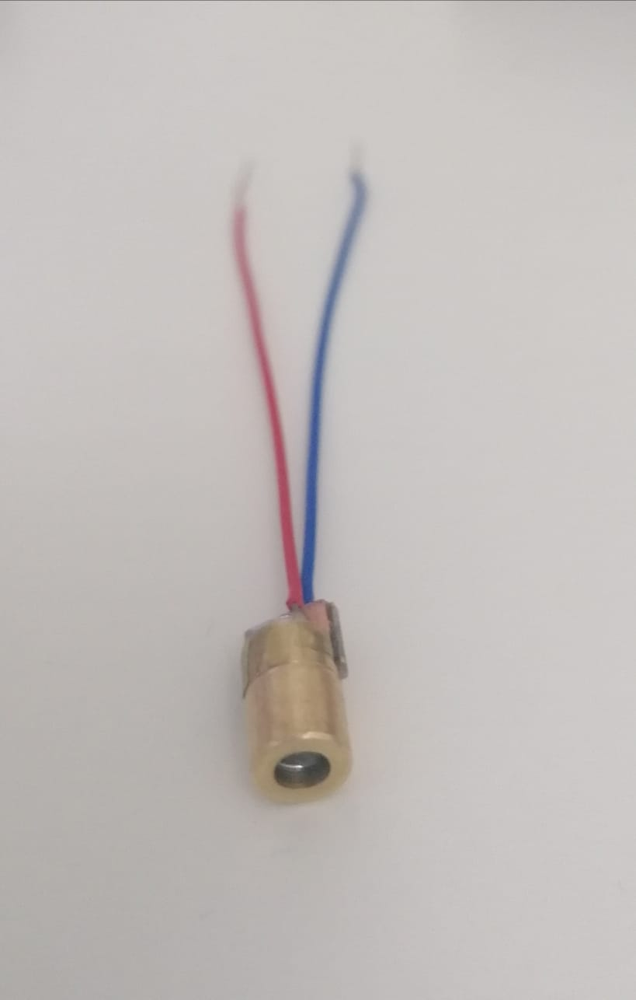 | 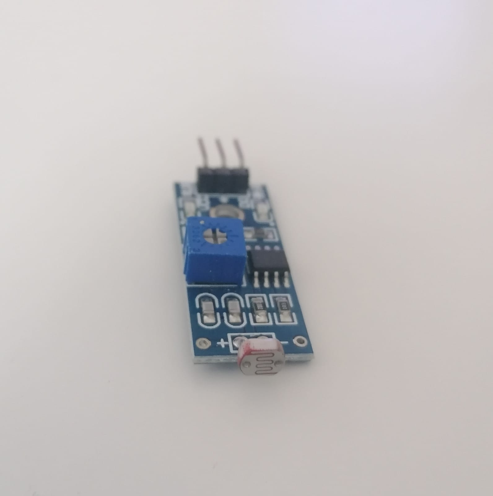 | 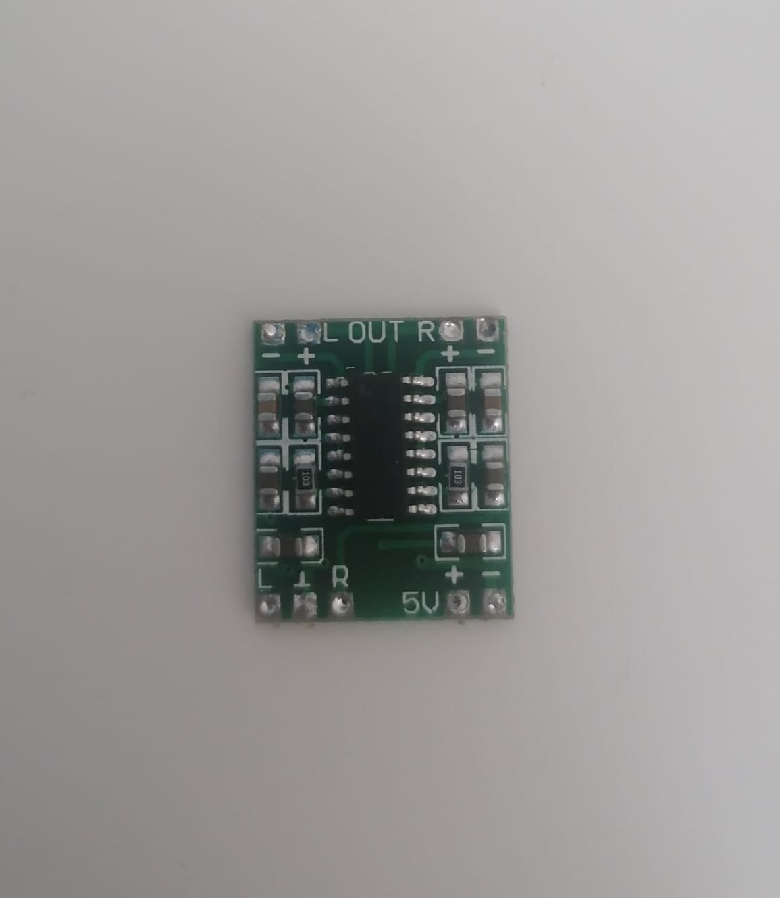 |

---

### 🧠 Working Principle

**Light Detection Using LDR:**

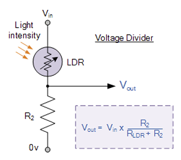

---

### 🎵 From Classical Harp to Optical

**Traditional Harp Inspiration:**

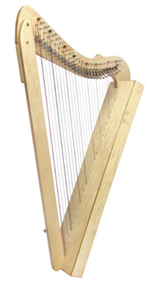

---

## 🧰 Full System Setup

This image shows the complete hardware setup used for HarpTronics:

- VGA-connected monitor for note display  
- Speaker + amplifier for sound output  
- LDR sensor modules and lasers for beam interruption  
- Basys 3 FPGA board controlling all logic

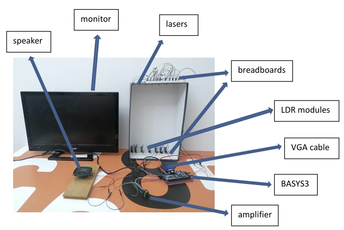

---

## 🛠️ Hardware Outputs

### 🔢 Seven-Segment Display States

| Output: 0294            | Output: 0523            |
|-------------------------|-------------------------|
| 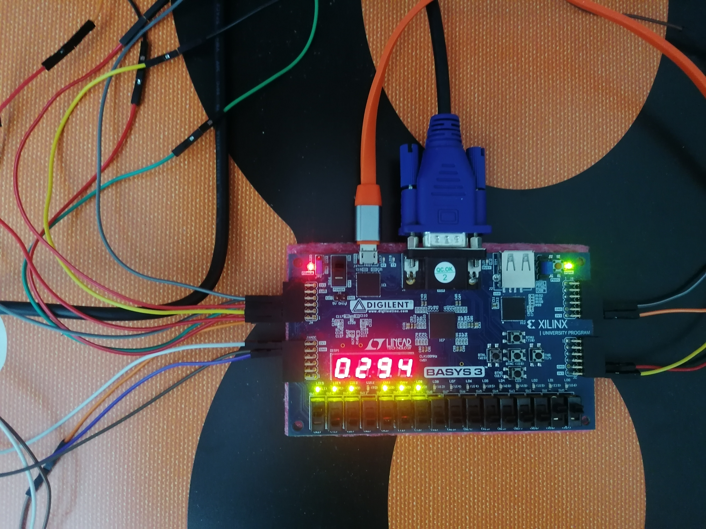 | 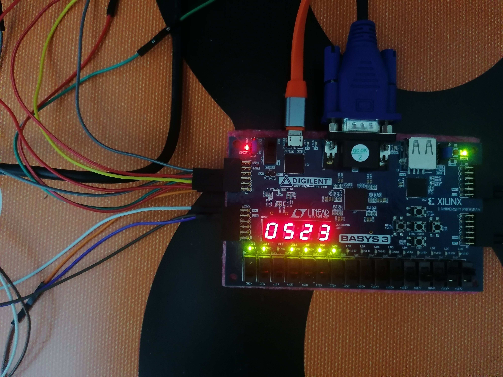 |

---

### 📺 VGA Note Detection

| Note "C"               | Note "D"               |
|------------------------|------------------------|
| 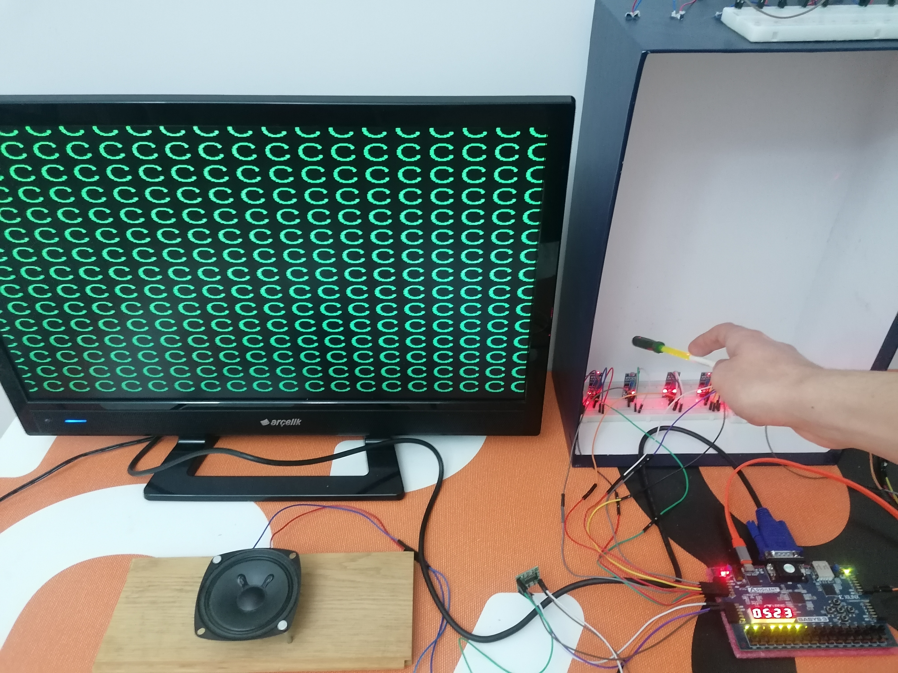 | 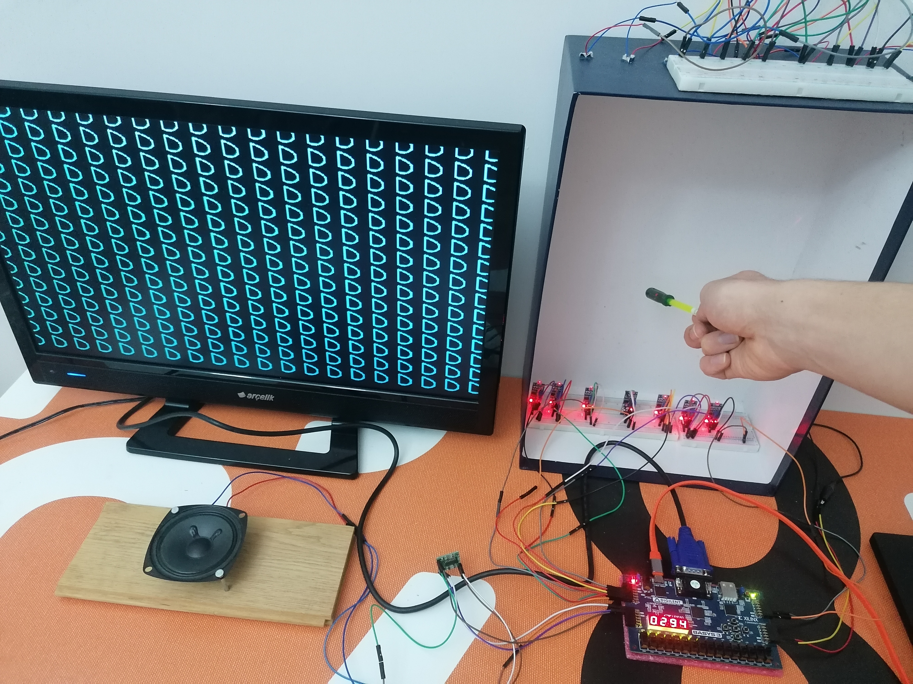 |

---

## 🖥️ VGA Timing – How the Display Works

The VGA output uses horizontal and vertical synchronization signals to scan and display pixels on a monitor.

Below is a visual representation of horizontal timing, including:
- Display time
- Sync pulses
- Retrace delays (front/back porch)

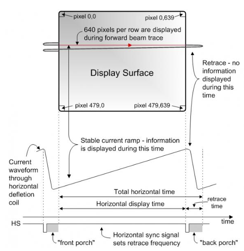

---

## 🎵 Musical Note Frequencies and Wavelengths

This extended table shows the frequencies and corresponding wavelengths of the musical notes detected and displayed by the system:

| Note        | Frequency (Hz) | Wavelength (cm) |
|-------------|----------------|-----------------|
| A3          | 220.00         | 156.82          |
| A#/Bb3      | 233.08         | 148.02          |
| B3          | 246.94         | 139.71          |
| C4          | 261.63         | 131.87          |
| C#/Db4      | 277.18         | 124.47          |
| D4          | 293.66         | 117.48          |
| D#/Eb4      | 311.13         | 110.89          |
| E4          | 329.63         | 104.66          |
| F4          | 349.23         | 98.79           |
| F#/Gb4      | 369.99         | 93.24           |
| G4          | 392.00         | 88.01           |
| G#/Ab4      | 415.30         | 83.07           |
| A4          | 440.00         | 78.41           |
| A#/Bb4      | 466.16         | 74.01           |
| B4          | 493.88         | 69.85           |
| C5          | 523.25         | 65.93           |
| C#/Db5      | 554.37         | 62.23           |
| D5          | 587.33         | 58.74           |
| D#/Eb5      | 622.25         | 55.44           |
| E5          | 659.25         | 52.33           |
| F5          | 698.46         | 49.39           |
| F#/Gb5      | 739.99         | 46.62           |
| G5          | 783.99         | 44.01           |

> These values provide the physical-musical mapping used to visualize detected notes and calculate harmonics.

---

## 🧪 Synthesis & Performance

| Metric               | Value     |
|----------------------|-----------|
| Max Clock Frequency  | 50 MHz    |
| Resource Usage       | ~15% LUTs |
| Timing Met?          | Yes       |
| Power (est.)         | ~100 mW   |

> Detailed reports available in `/synthesis/`

---

## 🚀 Getting Started

1. Open `laser_harp.xpr` in **Vivado**
2. Ensure your FPGA board is connected and matches the `.xdc` file
3. Run **Synthesis** → **Implementation** → **Generate Bitstream**
4. Flash the bitstream to your board  
   👉 [`design_laser_harp.bit`](bitstream/design_laser_harp.bit)
5. Watch the magic 🎶

---

## 🔌 Prebuilt Bitstream

You can directly program the FPGA using the provided bitstream file:

👉 [`design_laser_harp.bit`](bitstream/design_laser_harp.bit)

Use Vivado's Hardware Manager to connect your FPGA board and upload the bitstream.

---

## 📜 License

MIT License – Feel free to fork, remix, and build your own photon-powered instruments.

---

## 💡 Inspiration

> "A harp with no strings, yet full of music."  
> This project merges physics, hardware design, and creativity to explore new ways of interaction using light.