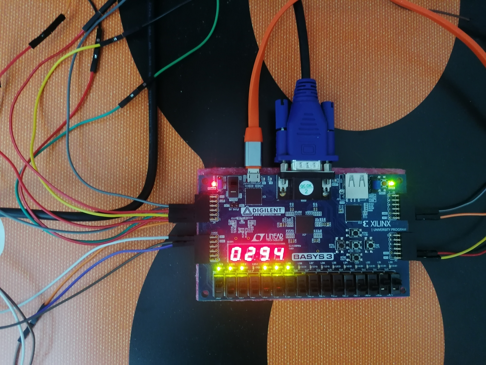
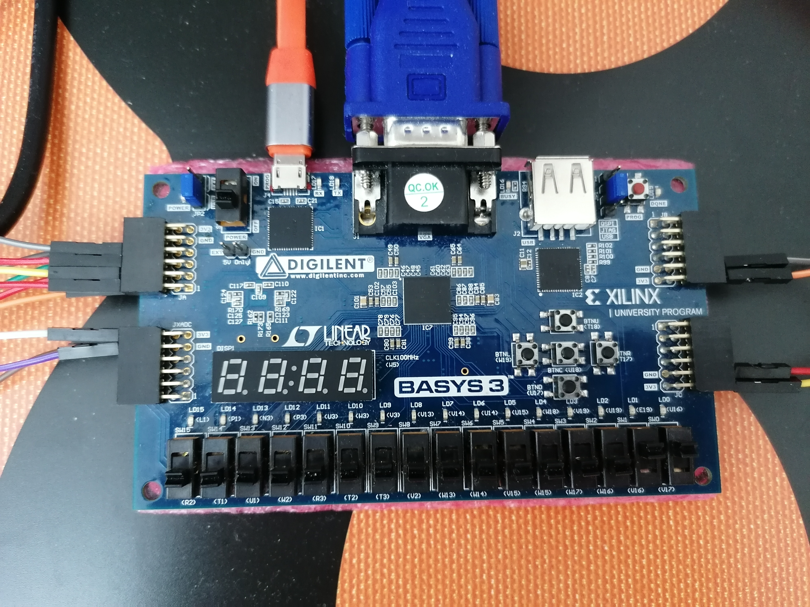
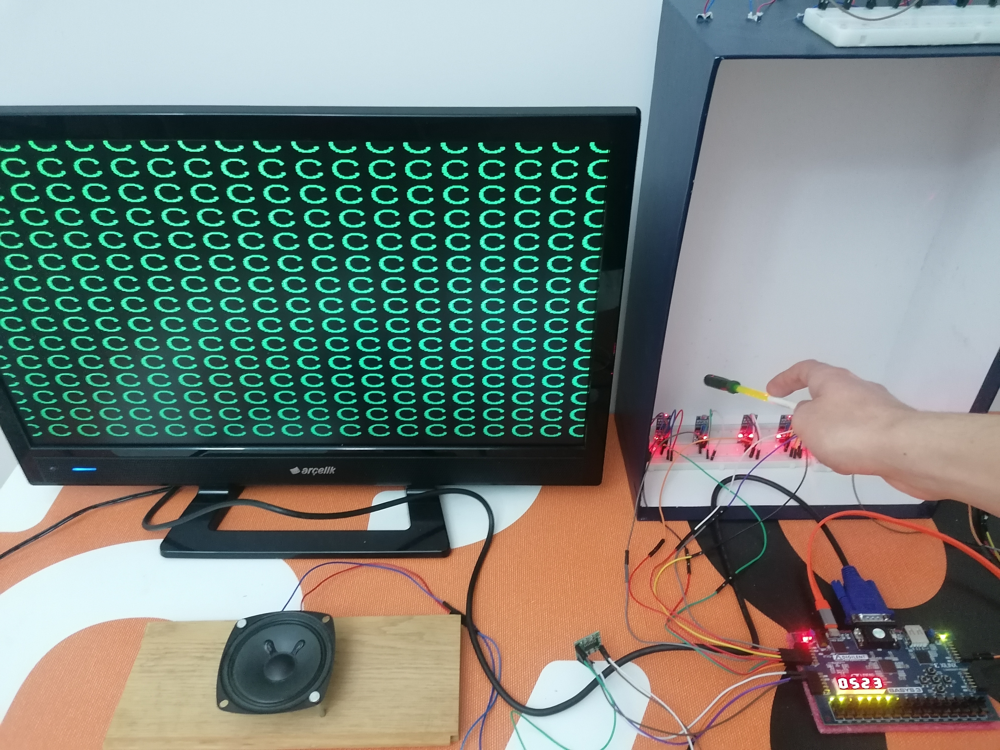
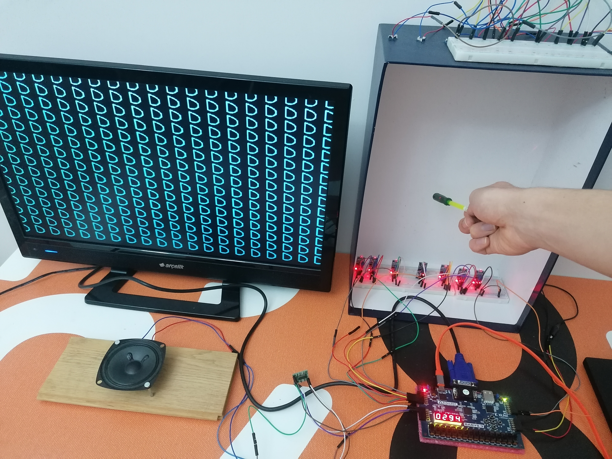
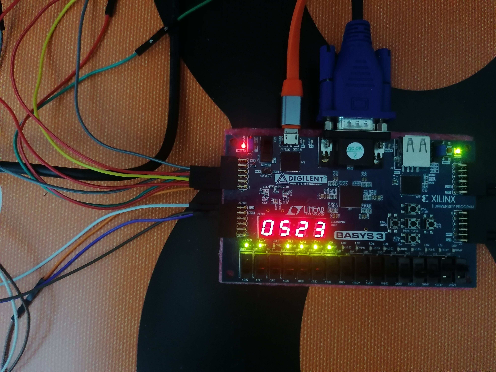

# 🎶 HarpTronics: An FPGA-Based Optical Laser Harp

Welcome to **HarpTronics** — a light-sensing, touchless laser harp designed and implemented on an FPGA platform. This project combines optical input, VGA display, and digital sound control, all driven by VHDL and hardware-level timing.

> 📁 Repository name: `fpga-optical-laser-harp`

---

## 🛠️ Project Overview

**HarpTronics** is a digital instrument built using VHDL on an FPGA, where invisible "strings" of light are plucked by interrupting laser beams with your fingers. The system reads inputs via **light sensors**, displays notes and states on **VGA** and **7-segment displays**, and operates entirely without physical strings.

---

## 🔧 Built With

- 🧠 **Xilinx Vivado** – Design and synthesis
- ⚙️ **VHDL** – All logic and modules
- 🧪 **FPGA Board** – Digilent Basys 3
- 💡 **Photoresistors / Light sensors** – For beam interruption
- 🔲 **VGA output** – Visual feedback
- 🔢 **7-segment display** – Note or state display

---

## 🎯 Features

- 🔦 Optical input using light sensors (photoresistors)
- 🎼 Real-time interaction with VGA visualization
- 🕒 Custom clock division for VGA and 7-segment display
- ⚡ Fully synchronous digital design using finite state machines
- 🔢 Multiplexed 7-segment driver with decoder logic
- ✅ Timing and resource utilization optimized and documented

---

## 📷 Screenshots / Diagrams

### 🔦 Core Components

| Laser Diode         | Light Sensor Module    | Audio Amplifier       |
|---------------------|------------------------|------------------------|
|  |  |  |

---

### 🧠 Working Principle

**Light Detection Using LDR:**

---

### 🎵 From Classical Harp to Optical

**Traditional Harp Inspiration:**

---

### 🛠️ Hardware Setup

| Basys 3 Connected        | Seven-Segment Active     | VGA + Laser Harp Demo   |
|--------------------------|--------------------------|--------------------------|
|  |  |  |

**More Demo Shots:**

  

---

## 🖥️ VGA Timing – How the Display Works

The VGA output uses horizontal and vertical synchronization signals to scan and display pixels on a monitor.

Below is a visual representation of horizontal timing, including:
- Display time
- Sync pulses
- Retrace delays (front/back porch)

---

## 🎵 Musical Note Frequencies and Wavelengths

This project visually displays musical notes (e.g., C, D, E...) detected via beam interruptions. Each note corresponds to a specific frequency and wavelength:

| Note | Frequency (Hz) | Wavelength (nm) |
|------|----------------|-----------------|
| C4   | 261.63         | 1312.5          |
| D4   | 293.66         | 1167.0          |
| E4   | 329.63         | 1040.3          |
| F4   | 349.23         | 981.4           |
| G4   | 392.00         | 874.7           |
| A4   | 440.00         | 780.0           |
| B4   | 493.88         | 695.6           |
| C5   | 523.25         | 656.0           |

> These values are used to visualize notes on screen and help match light interruptions with pitch output.

---

## 🧪 Synthesis & Performance

| Metric               | Value     |
|----------------------|-----------|
| Max Clock Frequency  | 50 MHz    |
| Resource Usage       | ~15% LUTs |
| Timing Met?          | Yes       |
| Power (est.)         | ~100 mW   |

> Detailed reports available in `/synthesis/`

---

## 🚀 Getting Started

1. Open `laser_harp.xpr` in **Vivado**
2. Ensure your FPGA board is connected and matches the `.xdc` file
3. Run **Synthesis** → **Implementation** → **Generate Bitstream**
4. Flash the bitstream to your board  
   👉 [`design_laser_harp.bit`](bitstream/design_laser_harp.bit)
5. Watch the magic 🎶

---

## 🔌 Prebuilt Bitstream

You can directly program the FPGA using the provided bitstream file:

👉 [`design_laser_harp.bit`](bitstream/design_laser_harp.bit)

Use Vivado's Hardware Manager to connect your FPGA board and upload the bitstream.

---

## 📜 License

MIT License – Feel free to fork, remix, and build your own photon-powered instruments.

---

## 💡 Inspiration

> "A harp with no strings, yet full of music."  
> This project merges physics, hardware design, and creativity to explore new ways of interaction using light.